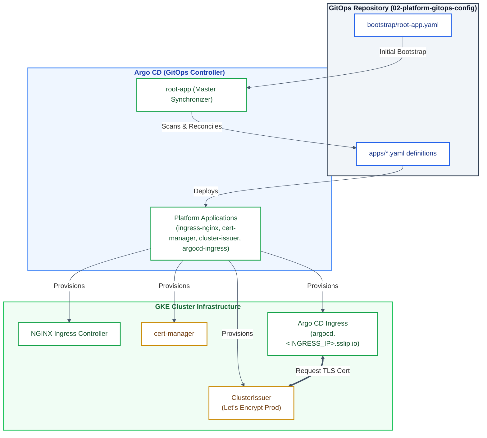

# [2/3] Cloud-Native Platform — GitOps Engine, Ingress Controller & Cert-Manager

[](https://argoproj.github.io/cd/)
[](https://kubernetes.io/)
[](https://kubernetes.github.io/ingress-nginx/)
[](https://letsencrypt.org/)
[](#architecture--core-components)

> **Enterprise Platform Core:** A fully automated GitOps repository leveraging Argo CD's "App of Apps" pattern to manage core Kubernetes infrastructure components, automated TLS certificate issuing, and ingress routing on Private GKE.

---

## Executive Summary

This repository acts as the continuous delivery engine (Project 2 of 3) for the Cloud-Native platform built on GKE and Cloud SQL. It enforces a declarative, Git-driven workflow to deploy and maintain platform-level controllers, TLS issuers, and ingress routes without manual `kubectl` intervention.

---

## Key Features & Platform Standards

* **App of Apps Pattern:** A single `root-app` monitors the `apps/` directory, automatically discovering and syncing all sub-applications.
* **Automated TLS (cert-manager):** Integrated with Let's Encrypt via HTTP-01 challenge (`ClusterIssuer`) for zero-touch SSL certificate provisioning and renewal.
* **Production Ingress (ingress-nginx):** Centralized entry-point for managing incoming traffic to internal services and cluster tools.
* **Configuration Drift Prevention:** Automated synchronization with `selfHeal: true` and `prune: true` enabled across all application manifests to eliminate manual cluster modifications.
* **Secure Backend Communication:** Configured with `nginx.ingress.kubernetes.io/backend-protocol: "HTTPS"` to establish end-to-end TLS communication with Argo CD's internal server without `502 Bad Gateway` errors.

---

## Architecture Diagram



---

## Repository Structure

```text
.
├── apps/                        # Application definitions tracked by root-app
│   ├── argocd-ingress.yaml      # Exposes Argo CD via Ingress & TLS
│   ├── cert-manager.yaml        # Deploys cert-manager via Helm
│   ├── cluster-issuer.yaml      # Instantiates Let's Encrypt ClusterIssuer
│   └── ingress-nginx.yaml       # Deploys NGINX Ingress Controller via Helm
├── bootstrap/                   # Initial cluster bootstrapping manifests
│   ├── kustomization.yaml       # Bootstrap manifests aggregation
│   ├── namespace.yaml           # argocd namespace definition
│   └── root-app.yaml            # Master App-of-Apps entrypoint
├── infrastructure/              # Raw Kubernetes manifests
│   ├── argocd/                  # Argo CD Ingress manifest
│   │   └── ingress.yaml
│   └── cert-manager/            # ClusterIssuer manifest
│       └── cluster-issuer.yaml
├── LICENSE
└── README.md
```

---

## Setup & Variables Configuration

Before applying these manifests to your cluster, update the following placeholders across the repository files to match your setup:

1. **GitHub Organization/User:** Replace `<YOUR_GITHUB_USERNAME>` in `bootstrap/root-app.yaml` and `apps/*.yaml` with your GitHub account name.
2. **Contact Email:** Replace `<YOUR_EMAIL>` in `infrastructure/cert-manager/cluster-issuer.yaml` with a valid email address for Let's Encrypt notifications.
3. **Ingress Hostnames:** Update the domain references in `infrastructure/argocd/ingress.yaml` to match your LoadBalancer IP (`argocd.<INGRESS_IP>.sslip.io`) or custom domain.

---

## Deployment Quickstart

### Prerequisites

* GKE Cluster deployed and accessible via `kubectl` (from **`01-platform-infra-terraform`**).
* **Argo CD** core installed in the cluster namespace.

### 1. Bootstrap the Platform

Apply the bootstrap configuration to launch the App of Apps mechanism:

```bash
kubectl apply -f bootstrap/namespace.yaml
kubectl apply -f bootstrap/root-app.yaml
```

Argo CD will immediately pick up the `root-app` and start reconciling all applications inside the `apps/` directory.

### 2. Force Sync (Optional)

To force Argo CD to immediately re-scan the repository:

```bash
kubectl patch application root-app -n argocd --type merge -p '{"metadata":{"annotations":{"argocd.argoproj.io/refresh":"hard"}}}'
```

---

## Access & Security Posture

### Public Endpoint Access

The Argo CD UI is securely exposed via NGINX Ingress with automated TLS termination.

1. Retrieve your external Ingress IP address:
   ```bash
   kubectl get svc -n ingress-nginx ingress-nginx-controller -o jsonpath='{.status.loadBalancer.ingress[0].ip}'
   ```

2. Access the UI:
   * **URL:** `https://argocd.<INGRESS_IP>.sslip.io`
   * **Default Username:** `admin`

### Retrieve Initial Password

Execute the following command to retrieve the auto-generated administrator password:

```bash
kubectl -n argocd get secret argocd-initial-admin-secret -o jsonpath="{.data.password}" | base64 -d; echo
```

> **Security Note:** In a production environment, change the administrator password immediately via the UI upon first login, and delete the initial secret from the cluster (`kubectl delete secret argocd-initial-admin-secret -n argocd`).

---

## Platform Ecosystem

This repository is **Part 2 of 3** in the Cloud-Native End-to-End Platform series:

1. [**`01-platform-infra-terraform`**](https://github.com/<YOUR_GITHUB_USERNAME>/01-platform-infra-terraform) — Provisioning base cloud infrastructure (VPC, GKE Private, Cloud SQL, Artifact Registry).
2. **`02-platform-gitops-config`** *(This repository)* — GitOps engine, Kubernetes controllers & cluster configuration (Argo CD, Ingress, Cert-Manager).
3. [**`03-sample-app-microservice`**](https://github.com/<YOUR_GITHUB_USERNAME>/03-sample-app-microservice) — Microservice application workloads and deployment manifests.